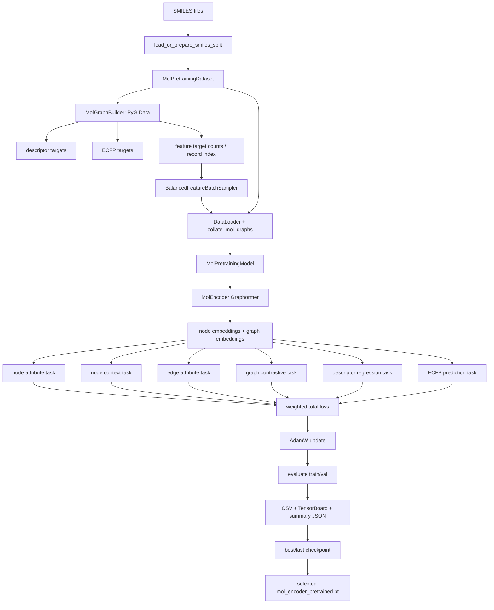
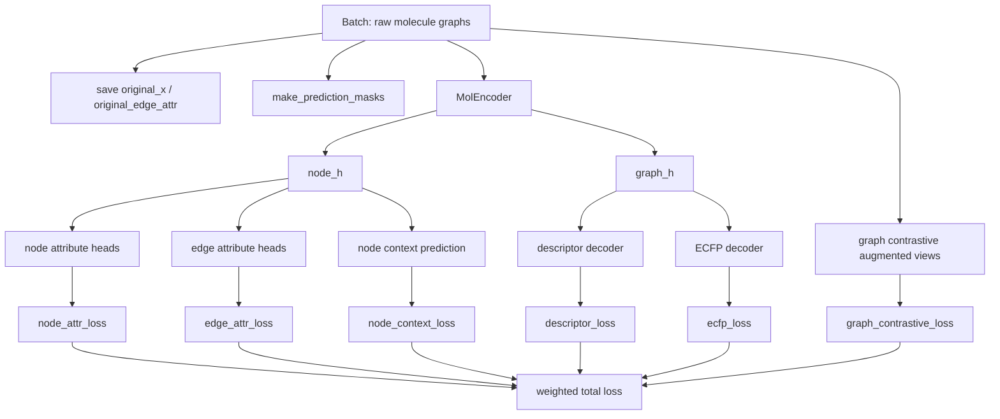
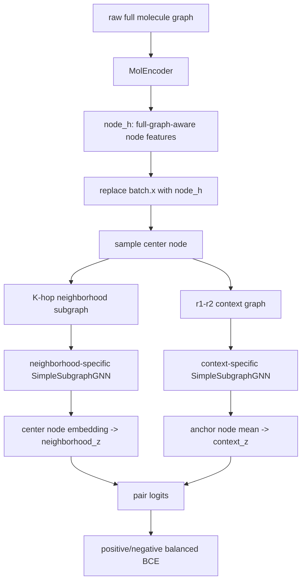

# mol_training Workflow Documentation

This document summarizes the molecular encoder pretraining workflow implemented in this package. It describes the code, data flow, training tasks, metrics, and output artifacts in repository-relative terms.

Unless otherwise noted, file names in this document are relative to `clefts/ml/training/mol_training/`, and output paths are relative to the user-provided `--output-dir`. Avoid relying on machine-specific absolute paths when copying examples or documenting runs.

Target code:

- `training_model.py`: CLI, preprocessing, config sweep, training stage execution, summary/checkpoint selection
- `dataset.py`: SMILES loading, molecular graph conversion, descriptor/ECFP target creation, dataset cache
- `feature_schema.py`: splits node/edge features into semantically meaningful groups and computes losses/metrics
- `masking.py`: node/edge mask creation, rare-class mask assistance, contrastive view creation
- `pretraining_model.py`: main `MolPretrainingModel`, loss calculation for multiple pretraining tasks
- `trainer.py`: DataLoader, rare attribute batch sampler, epoch loop, evaluation, TensorBoard/CSV/checkpoint outputs

---

## 1. Purpose

The purpose of `mol_training` is to create molecular graphs from SMILES and pretrain `MolEncoder`.
Instead of using only a single supervised task, it jointly trains multiple node-level, edge-level, and graph-level tasks.

Main goals:

1. Build node representations that can predict atom attributes
2. Build edge-aware node representations that can predict bond attributes
3. Build graph representations that can explain molecular descriptors and fingerprints
4. Build graph representations that are robust to graph augmentation
5. Learn the correspondence between a center-node neighborhood and its context graph, and incorporate the relationship between local and surrounding structures into the representation
6. Support masking and batch sampling so that rare node/edge attributes are not missed during training

---

## 2. Overall Flow



---

## 3. Input Data

### 3.1 SMILES

The input is a newline-delimited SMILES file.
In the CLI, these are specified as follows.

- `--train-smiles`: SMILES file(s) for training
- `--val-smiles`: SMILES file(s) for validation

`load_or_prepare_smiles_split` in `training_model.py` is responsible for the following.

- Loading train/val SMILES
- Removing duplicates based on canonical SMILES
- Saving the train/val split cache
- Creating a cache manifest that can be reused when the same inputs are provided

Example output:

- `pretraining_smiles_split_cache.json`

### 3.2 Atom symbols

The atom symbols to use are specified with `--symbols`.
This is passed to `MolGraphBuilder` and `AtomFeatureLayer`, and determines dimensions such as the symbol one-hot dimension of node features.

Example:

```bash
--symbols C,N,O,S,F,Cl,Br,I,P,B,Si
```

---

## 4. Dataset Creation

`MolPretrainingDataset` in `dataset.py` is responsible for this step.

### 4.1 Processing for each molecule

For each SMILES, the following objects are created.

1. Convert to an internal representation containing an RDKit molecule using `Compound.from_smiles(smiles)`
2. Create a PyTorch Geometric `Data` object using `MolGraphBuilder.build(compound)`
3. Save the canonical SMILES in `data.smiles`
4. Save the RDKit descriptor target in `data.descriptors`
5. Save the ECFP/Morgan fingerprint target in `data.ecfp`

Main fields of `Data`:

- `x`: atom/node feature tensor
- `edge_index`: graph edge index
- `edge_attr`: bond/edge feature tensor
- `smiles`: molecule SMILES
- `descriptors`: graph-level regression target
- `ecfp`: graph-level binary fingerprint target

### 4.2 Descriptor target

Default descriptors:

- `ExactMolWt`
- `HeavyAtomCount`
- `TPSA`
- `MolLogP`
- `NumHAcceptors`
- `NumHDonors`
- `NumRotatableBonds`
- `RingCount`
- `NumAromaticRings`
- `NumAliphaticRings`
- `FractionCSP3`
- `NumHeteroatoms`
- `FormalCharge`
- `BertzCT`

The descriptors are standardized using the mean/std of the training set by `DescriptorNormalizer.fit(train_dataset.descriptor_matrix())`.
The same normalizer is also used for validation.

### 4.3 ECFP target

Morgan fingerprints are created with `compute_ecfp`.

Defaults:

- radius: `2`
- n_bits: `2048`

CLI:

- `--ecfp-radius`
- `--ecfp-n-bits`

Most ECFP bits tend to be 0, so the loss separates positive bits and negative bits and makes them have equal influence.

---

## 5. Preprocessing Cache

`build_or_load_preprocessed_datasets` in `training_model.py` is responsible for this step.

The cache contains the following.

- manifest
- descriptor mean/std
- train PyG `Data` list
- validation PyG `Data` list

Items included in the manifest:

- cache version
- symbols
- descriptor names
- train SMILES list
- validation SMILES list
- ECFP radius
- number of ECFP bits

This prevents old caches from being incorrectly reused when settings change, and rebuilds the cache instead.

Example output:

- `pretraining_preprocessed_dataset.pt`

---

## 6. Feature Schema

`feature_schema.py` is the layer that handles node/edge feature tensors as semantically meaningful groups.

### 6.1 FeatureGroup

`FeatureGroup` stores slice information for the feature tensor.

Fields:

- `name`: group name
- `start`: feature start index
- `stop`: feature end index
- `values`: list of class labels
- `dim`: number of classes
- `labels`: list of string labels

### 6.2 Node feature groups

`atom_feature_groups(symbols)` creates groups from `AtomFeatureLayer`.
Representative groups:

- `symbol`
- `charge`
- `ring_type`
- `hybridization`
- `num_hydrogens`
- `valence_electrons`

### 6.3 Edge feature groups

`bond_feature_groups()` creates groups from `BondFeatureLayer`.
Representative groups:

- `bond_type`
- `ring_type`

### 6.4 grouped_cross_entropy

In node attribute / edge attribute prediction, the full feature vector is not classified all at once; instead, classification is performed separately for each group.

Examples:

- node `symbol` head
- node `hybridization` head
- edge `bond_type` head

Cross entropy is computed for each group, and group-level loss/acc/count/class acc are emitted as metrics.

---

## 7. Rare Attribute Handling

If rare classes do not appear for a long time in ordinary random batches/masks, the model becomes less likely to learn rare classes.
Therefore, this implementation includes two levels of support.

---

### 7.1 Dataset-level record index

`MolPretrainingDataset.feature_record_index` records molecule indices that contain each attribute class.

Structure example:

```python
{
  "node": {
    "hybridization": {
      "sp3": [0, 1, 5, ...],
      "sp3d2": [123, 882, ...]
    }
  },
  "edge": {
    "bond_type": {
      "SINGLE": [0, 1, 2, ...],
      "TRIPLE": [31, 99, ...]
    }
  }
}
```

This is created by `build_feature_record_index` in `training_model.py`.

---

### 7.2 Batch-level forced sampling

`BalancedFeatureBatchSampler` in `trainer.py` is responsible for this.

Behavior:

1. For each class, track how many batches have passed since it last appeared in a batch
2. Find classes that have not appeared for at least `patience` batches
3. Randomly select a molecule index that contains that class
4. Replace an earlier slot in the batch
5. Force insertion up to `max_forced_per_batch`

CLI:

- `--disable-balanced-record-sampling`
- `--mask-balance-patience`
- `--mask-balance-max-forced-per-batch`

Purpose:

- Periodically include molecules with rare node attributes in training batches
- Periodically include molecules with rare edge attributes in training batches

---

### 7.3 Mask-level forced coverage

`FeatureMaskBalancer` in `masking.py` is responsible for this.

Even if a molecule containing a rare class is included in the batch, the class does not become a target for attribute prediction unless that node/edge is masked.
Therefore, mask selection is also supported.

Behavior:

1. Create a random mask
2. Check whether masked nodes/edges cover each class
3. If a class has not been masked for at least `patience` batches and exists in the batch, forcibly add a node/edge of that class to the mask
4. Add forced masks up to `max_forced_per_batch`

During validation, `force_feature_class_coverage` can support coverage of classes present within the batch.

CLI:

- `--disable-balanced-attribute-masking`
- `--disable-balanced-validation-masks`
- `--mask-balance-patience`
- `--mask-balance-max-forced-per-batch`

---

## 8. DataLoader and Collate

`make_loader` in `trainer.py` creates the DataLoader.

During training:

- `shuffle=True`
- Use `BalancedFeatureBatchSampler` if balanced sampling is enabled
- `collate_fn=collate_mol_graphs`

During validation:

- `shuffle=False`
- Ordinary batching

`collate_mol_graphs` in `dataset.py` uses `Batch.from_data_list` to merge a list of PyG `Data` objects into a single PyG `Batch`.

---

## 9. Overall Structure of MolPretrainingModel

`MolPretrainingModel` in `pretraining_model.py` computes losses for multiple tasks in a single forward pass.



---

## 10. Task 1: Masked Node Attribute Prediction

### 10.1 Input

- `node_h`: node embeddings after MolEncoder
- `original_x`: node features before masking
- `mask_info.node_mask`: nodes used as prediction targets

### 10.2 Processing

1. Extract node embeddings for masked nodes
2. Pass them through a decoder for each attribute group
3. Compute group-wise cross entropy with `grouped_cross_entropy`
4. Use the average group loss as `node_attr_loss`

### 10.3 Metrics

Representative examples:

- `node_attr_loss`
- `node_symbol_loss`
- `node_symbol_acc`
- `node_symbol_count`
- `node_symbol_C_acc`
- `node_hybridization_acc`
- `node_hybridization_sp3d2_acc`

TensorBoard grouping:

- `node_attr_acc`: overall feature accuracies and per-class accuracies
- `node_attr_loss`: total node attribute loss and per-feature losses
- `node_attr_count`: per-feature and per-class counts

---

## 11. Task 2: Node Context Prediction

Context prediction learns whether a K-hop neighborhood around a center node and the surrounding context graph originate from the same center.

Defaults:

- `K = 2`
- `r1 = 1`
- `r2 = 4`

CLI:

- `--context-k`
- `--context-r1`
- `--context-r2`

### 11.1 Important design

`MolEncoder` is first applied to the full molecular graph.
The resulting `node_h` is then used to create subgraphs for context prediction.

In other words, the subgraphs for context prediction do not use raw atom features; instead, they use node embeddings that already contain full-graph context.



### 11.2 Neighborhood graph

The neighborhood graph is an induced subgraph created by collecting nodes whose distance from the center node is `<= K`.

- node feature: `node_h` after `MolEncoder`
- edge structure: corresponding edges from the original graph
- edge feature: original `edge_attr`
- readout: center node representation

### 11.3 Context graph

The context graph is an induced subgraph created by collecting nodes whose distance from the center node satisfies `r1 <= distance <= r2`.

- node feature: `node_h` after `MolEncoder`
- edge structure: edges within the context range
- edge feature: original `edge_attr`
- readout: mean of anchor node representations

Anchor nodes are taken from the range `r1 <= distance <= K`.

### 11.4 Dedicated GNN

MolEncoder is not reused on the subgraphs for context prediction.
Instead, the following two lightweight GNNs are used.

- `context_neighborhood_gnn`
- `context_graph_gnn`

Both are `SimpleSubgraphGNN`.

`SimpleSubgraphGNN` performs the following steps.

1. Project node features to the hidden dimension
2. For each edge, create a message from `source node hidden + edge_attr`
3. Aggregate messages into destination nodes
4. Apply residual update + LayerNorm
5. Repeat for the specified number of layers

### 11.5 Positive / Negative loss

Pair logits are computed as `neighborhood_z @ context_z.T / temperature`.

- Diagonal entries: positive pairs
- Off-diagonal entries: negative pairs

The loss is constructed so that positive and negative examples each contribute half.

```python
node_context_loss = 0.5 * (node_context_pos_loss + node_context_neg_loss)
```

The number of negative pairs is much larger than the number of positive pairs, but because each side is averaged first and then combined with 0.5 weight, the loss is less affected by class imbalance.

### 11.6 Metrics

- `node_context_loss`
- `node_context_acc`
- `node_context_pos_loss`
- `node_context_neg_loss`
- `node_context_pos_acc`
- `node_context_neg_acc`
- `node_context_pos_count`
- `node_context_neg_count`

`node_context_acc` is also balanced accuracy.

```python
node_context_acc = 0.5 * (node_context_pos_acc + node_context_neg_acc)
```

---

## 12. Task 3: Masked Edge Attribute Prediction

### 12.1 Input

- `node_h`: node embeddings after MolEncoder
- `original_edge_attr`: edge features before masking
- `mask_info.edge_mask`: edges used as prediction targets

### 12.2 Edge representation

`edge_pair_repr` combines the node embeddings at both ends of an edge.

```python
edge_repr = concat([
    h_src + h_dst,
    h_src * h_dst,
    abs(h_src - h_dst),
])
```

### 12.3 Processing

1. Create `edge_repr` for masked edges
2. Pass it through a decoder for each edge attribute group
3. Compute group-wise cross entropy with `grouped_cross_entropy`
4. Use the average group loss as `edge_attr_loss`

### 12.4 Metrics

Representative examples:

- `edge_attr_loss`
- `edge_bond_type_loss`
- `edge_bond_type_acc`
- `edge_bond_type_SINGLE_acc`
- `edge_ring_type_acc`

TensorBoard grouping:

- `edge_attr_acc`: overall feature accuracies and per-class accuracies
- `edge_attr_loss`: total edge attribute loss and per-feature losses
- `edge_attr_count`: per-feature and per-class counts

---

## 13. Task 4: Graph Contrastive Learning

Graph contrastive learning creates two augmented views from the same molecule and brings them closer as a positive pair.

### 13.1 View creation

`make_contrastive_view` performs the following operations.

1. Replace part of the node features with a mask token
2. Drop undirected edge pairs with a specified probability

CLI:

- `--graph-contrastive-node-mask-ratio`
- `--graph-contrastive-edge-drop-ratio`

### 13.2 Contrastive loss

1. Pass view1 and view2 through MolEncoder
2. Pass graph embeddings through a projection head
3. Create cosine similarity logits
4. Use cross entropy with the same batch index as the positive pair
5. Average row-wise and column-wise losses

Metric:

- `graph_contrastive_loss`

---

## 14. Task 5: Graph Descriptor Regression

RDKit descriptors are predicted from the graph embedding `graph_h`.

### 14.1 Target

This is the descriptor vector stored in `data.descriptors`.
It is normalized with the mean/std of the training set.

The current default targets are `ExactMolWt`, `HeavyAtomCount`, `TPSA`, `MolLogP`, `NumHAcceptors`, `NumHDonors`, `NumRotatableBonds`, `RingCount`, `NumAromaticRings`, `NumAliphaticRings`, `FractionCSP3`, `NumHeteroatoms`, `FormalCharge`, and `BertzCT`.

### 14.2 Loss

MSE is computed for each descriptor and then averaged.

Metrics:

- `descriptor_loss`
- `descriptor_<name>_loss`

### 14.3 R2 metrics

Because descriptors are regression targets, R2 is reported instead of accuracy.
R2 is computed over the entire epoch.

Internally, the following statistics are emitted per batch.

- `descriptor_<name>_sse`
- `descriptor_<name>_target_sum`
- `descriptor_<name>_target_sq_sum`
- `descriptor_<name>_count`

`trainer.mean_metrics` converts them into the following metric during epoch aggregation.

- `descriptor_<name>_r2`

Meaning of R2:

- `1.0`: perfect prediction
- `0.0`: equivalent to a baseline that predicts the target mean
- `< 0.0`: worse than the baseline

TensorBoard:

- `descriptor_loss`: total descriptor loss and per-target losses
- `descriptor/r2_by_target`: per-target R2

---

## 15. Task 6: Graph ECFP Prediction

ECFP/Morgan fingerprint bit vectors are predicted from the graph embedding `graph_h`.

### 15.1 Target

This is the binary vector stored in `data.ecfp`.

Defaults:

- radius: `2`
- bits: `2048`

### 15.2 Positive/negative balanced BCE

Most ECFP bits are 0.
If ordinary BCE is used, a model that predicts mostly 0 can obtain a good loss.

Therefore, positive bits and negative bits are separated, their losses are averaged independently, and both sides contribute equally.

```python
ecfp_loss = 0.5 * (ecfp_pos_loss + ecfp_neg_loss)
```

### 15.3 Metrics

- `ecfp_loss`
- `ecfp_acc`
- `ecfp_pos_loss`
- `ecfp_neg_loss`
- `ecfp_pos_acc`
- `ecfp_neg_acc`
- `ecfp_pos_count`
- `ecfp_neg_count`

---

## 16. Total Loss

Each task loss is multiplied by a weight and summed.

```python
total_loss = (
    node_loss_weight * node_attr_loss
    + context_loss_weight * node_context_loss
    + edge_loss_weight * edge_attr_loss
    + graph_contrastive_loss_weight * graph_contrastive_loss
    + descriptor_loss_weight * descriptor_loss
    + ecfp_loss_weight * ecfp_loss
)
```

CLI:

- `--node-loss-weight`
- `--context-loss-weight`
- `--edge-loss-weight`
- `--graph-contrastive-loss-weight`
- `--descriptor-loss-weight`
- `--ecfp-loss-weight`

Each task can be disabled with a disable flag.

---

## 17. Training Loop

`train_epochs` in `trainer.py` is responsible for the training loop.

### 17.1 Epoch 0 evaluation

Train/validation evaluation is performed before training starts.
This records the initial loss/metrics in CSV and TensorBoard.

### 17.2 Training epoch

Each epoch performs the following steps.

1. `model.train()`
2. Move batch to device
3. Compute all task losses/metrics in the forward pass
4. `output.loss.backward()`
5. Gradient clipping
6. AdamW step
7. Save batch metrics
8. Average/aggregate metrics at the end of the epoch

Optimizer:

- AdamW
- weight decay: `1e-2`
- grad clip norm: `1.0`

### 17.3 Validation

At the end of each epoch, evaluation is performed with the validation loader.
Validation is run under `torch.no_grad()`.

### 17.4 Early stopping

Early stopping is performed based on validation loss.

- mode: `min`
- metric: `val_loss`

---

## 18. Metrics Aggregation

`trainer.mean_metrics` converts batch metrics into epoch metrics.

### 18.1 count

`*_count` values are summed instead of averaged.

### 18.2 accuracy

If a corresponding `*_count` exists, `*_acc` is computed as a weighted average.

Example:

```python
node_symbol_acc = sum(batch_acc * batch_count) / sum(batch_count)
```

### 18.3 descriptor R2

Descriptor R2 is not computed as an average of batch R2 values.
Instead, it is computed from SSE/target statistics over the entire epoch.

---

## 19. TensorBoard Design

The TensorBoard writer is created in `trainer.py`.

Output destination:

```text
<run_dir>/tensorboard
```

The TensorBoard launch command is saved here:

```text
<run_dir>/tensorboard_command.txt
```

### 19.1 Basic metrics

These are written with `add_scalars` as train/val pairs.

Examples:

- `loss`
- `node_attr_loss`
- `edge_attr_loss`
- `node_context_loss`
- `graph_contrastive_loss`
- `descriptor_loss`
- `ecfp_loss`

### 19.2 Attribute grouping

Node and edge attribute metrics are grouped by metric kind instead of feature group.

- `node_attr_acc`, `node_attr_loss`, `node_attr_count`
- `edge_attr_acc`, `edge_attr_loss`, `edge_attr_count`

Each chart contains train/val series for the total metric, feature-level metrics, and class-level metrics where applicable.

### 19.3 Node context and ECFP grouping

Positive and negative breakdowns are kept in the same chart as the total metric.

- `node_context_acc`, `node_context_loss`, `node_context_count`
- `ecfp_acc`, `ecfp_loss`, `ecfp_count`

### 19.4 Descriptor grouping

- `descriptor_loss`: total descriptor loss and per-target losses
- `descriptor/r2_by_target`: per-target R2

---

## 20. Output Files

A single run mainly produces the following outputs.

### 20.1 Top-level output

- `pretraining_config.json`
- `feature_target_summary.json`
- `pretraining_smiles_split_cache.json`
- `pretraining_preprocessed_dataset.pt`
- `mol_encoder_pretraining_summary.csv`
- `mol_encoder_pretraining_summary.tsv`
- `mol_encoder_pretraining_summary.json`
- `mol_encoder_pretrained.pt`

### 20.2 Per-run output

Each config ID produces the following directory.

```text
runs/<config_id>/
```

Contents:

- `pretraining_metrics.csv`
- `pretraining_summary.json`
- `pretraining_best.pt`
- `pretraining_last.pt`
- `tensorboard/`
- `tensorboard_command.txt`

---

## 21. Config Sweep and Checkpoint Selection

`training_model.py` can try multiple MolEncoder configs.

Arguments that become candidate lists:

- `--node-dim`
- `--graph-dim`
- `--num-layers`
- `--num-heads`
- `--max-degree`
- `--max-spatial-dist`
- `--max-edge-dist`

All combinations are created with `itertools.product`.

Constraints:

- `node_dim % num_heads == 0`
- `graph_dim >= node_dim`
- `graph_dim % node_dim == 0`

Selection score:

```python
selection_score = best_val_loss + dimension_penalty * node_dim
```

In other words, if validation losses are similar, a smaller node dimension is slightly preferred.

The following file is created from the checkpoint of the best run.

```text
mol_encoder_pretrained.pt
```

---

## 22. CLI Argument Overview

### Data / IO

| Argument | Meaning |
|---|---|
| `--train-smiles` | training SMILES files |
| `--val-smiles` | validation SMILES files |
| `--output-dir` | output directory |
| `--device` | torch device |
| `--preprocessing-cache` | preprocessed dataset cache path |
| `--rebuild-preprocessing-cache` | rebuild cache |

### Model config

| Argument | Meaning |
|---|---|
| `--symbols` | comma-separated atom symbols |
| `--node-dim` | node embedding dimension candidates |
| `--graph-dim` | graph embedding dimension candidates |
| `--num-layers` | Graphormer layer count candidates |
| `--num-heads` | attention head count candidates |
| `--max-degree` | max degree encoding |
| `--max-spatial-dist` | max shortest-path distance |
| `--max-edge-dist` | max edge-path distance |
| `--dropout` | dropout rate |

### Training

| Argument | Meaning |
|---|---|
| `--batch-size` | molecules per batch |
| `--num-workers` | DataLoader workers |
| `--lr` | AdamW learning rate |
| `--epochs` | max epochs |
| `--early-stopping-*` | early stopping parameters |

### Masking / rare class balance

| Argument | Meaning |
|---|---|
| `--node-mask-ratio` | node attribute random mask ratio |
| `--edge-mask-ratio` | edge attribute random mask ratio |
| `--disable-balanced-attribute-masking` | disable forced mask coverage |
| `--disable-balanced-record-sampling` | disable forced rare molecule sampling |
| `--mask-balance-patience` | absent batch threshold before forcing |
| `--mask-balance-max-forced-per-batch` | max forced items per batch |

### Task switches

| Argument | Meaning |
|---|---|
| `--disable-node-attribute` | disable node attribute prediction |
| `--disable-node-context` | disable node context prediction |
| `--disable-edge-attribute` | disable edge attribute prediction |
| `--disable-graph-contrastive` | disable graph contrastive learning |
| `--disable-graph-descriptors` | disable descriptor regression |
| `--disable-graph-ecfp` | disable ECFP prediction |

### Task parameters

| Argument | Meaning |
|---|---|
| `--context-k` | K-hop neighborhood radius |
| `--context-r1` | context graph inner radius |
| `--context-r2` | context graph outer radius |
| `--graph-contrastive-node-mask-ratio` | node mask ratio for contrastive views |
| `--graph-contrastive-edge-drop-ratio` | edge drop ratio for contrastive views |
| `--graph-contrastive-temperature` | contrastive/context temperature |
| `--descriptor-names` | descriptor regression targets |
| `--ecfp-radius` | ECFP radius |
| `--ecfp-n-bits` | ECFP bit length |

### Loss weights

| Argument | Meaning |
|---|---|
| `--node-loss-weight` | node attribute loss weight |
| `--context-loss-weight` | context prediction loss weight |
| `--edge-loss-weight` | edge attribute loss weight |
| `--graph-contrastive-loss-weight` | graph contrastive loss weight |
| `--descriptor-loss-weight` | descriptor loss weight |
| `--ecfp-loss-weight` | ECFP loss weight |

---

## 23. Slide Outline Suggestion

If this Markdown is converted into slides, the following structure is natural.

1. Title: MolEncoder pretraining workflow
2. Goal: why pretrain with multiple tasks
3. Input data: SMILES -> molecule graph
4. Dataset: graph, descriptor, ECFP target
5. Cache: reproducible preprocessing
6. Feature schema: node/edge feature groups
7. Rare class problem and balancing strategy
8. Overall model architecture diagram
9. Task 1: masked node attribute prediction
10. Task 2: node context prediction
11. Task 3: masked edge attribute prediction
12. Task 4: graph contrastive learning
13. Task 5: descriptor regression with R2
14. Task 6: ECFP prediction with positive/negative balancing
15. Total loss and loss weights
16. Training loop and early stopping
17. TensorBoard and metrics organization
18. Output artifacts and checkpoint selection
19. Key implementation choices
20. Current strengths and next possible improvements

---

## 24. Key Implementation Choices to Emphasize

- `MolEncoder` is the central model that produces node/graph embeddings from the full graph
- Context prediction creates subgraphs with `node_h` obtained from the full graph and processes neighborhood/context with dedicated GNNs
- Context loss uses balanced BCE so that positive/negative pairs each contribute half
- ECFP loss also uses balanced BCE so that positive/negative bits each contribute half
- Descriptors report R2 instead of accuracy
- Rare attribute classes are supported in two stages: dataset-level sampling and mask-level coverage
- TensorBoard groups sparse metrics into `node_attr_*`, `edge_attr_*`, `node_context_*`, `ecfp_*`, and descriptor charts

---

## 25. One-sentence Summary

`mol_training` is a reproducible training workflow that creates molecular graphs from SMILES and pretrains MolEncoder using node attributes, edge attributes, context prediction, graph contrastive learning, descriptor regression, and ECFP prediction, with rare attribute coverage and detailed metrics.
